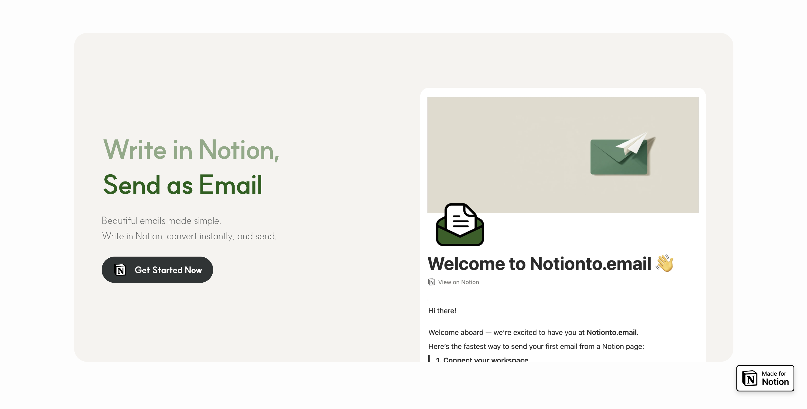

# notion-to-email

**Write in Notion. Send as email.**

<p align="center">
  
</p>

<p align="center">
  <a href="https://www.npmjs.com/package/notion-to-email"></a>
  <a href="https://www.npmjs.com/package/notion-to-email"></a>
  
  <a href="https://github.com/Sangkwun/notion-to-email/blob/main/LICENSE"></a>
</p>

---

Notion page ID 하나로 Gmail, Outlook, Apple Mail에서 깨지지 않는 이메일 HTML을 생성합니다.

```typescript
import { renderFromNotion } from 'notion-to-email'

const { html, title } = await renderFromNotion({
  pageId: 'your-page-id',
  token: 'your-notion-token',
})
```

`html`을 그대로 SES, SendGrid, Nodemailer에 넘기면 됩니다.

## react-email 없이

react-email은 Notion 블록을 이메일로 바꿀 때 래핑 엘리먼트를 과도하게 생성합니다. 같은 페이지를 변환했을 때:

| | react-email | notion-to-email |
|---|---|---|
| 접근 방식 | JSX → `renderToStaticMarkup` | 직접 string 생성 |
| 불필요한 래핑 | `<div>` 중첩 다수 | 없음 |
| 런타임 의존성 | react, react-dom, @react-email/* | 없음 |

## 지원 블록

Paragraph, Heading 1–4, Bulleted/Numbered List, To-Do, Toggle, Quote, Callout, Divider, Code, Equation, Image, Video (YouTube), File, Bookmark, Table, Column List, Child Page, Child Database, Synced Block, Link to Page, Table of Contents

Rich text: **bold**, *italic*, ~~strikethrough~~, `code`, underline, colors, links, mentions

## Options

```typescript
await renderFromNotion({
  pageId: 'your-page-id',
  token: 'your-token',
  options: {
    // Private 페이지 이미지를 자체 CDN으로 프록시
    resolveImageUrl: (url, context) => {
      return `https://your-cdn.com/proxy?url=${encodeURIComponent(url)}`
    },

    header: {
      showNotionButton: true,
      notionButtonLabel: 'Open in Notion',
    },

    // HTML string 또는 false
    footer: '<p>Sent via My App</p>',

    // 'hide' | 'placeholder' | ((blockType) => string)
    onUnsupportedBlock: 'placeholder',
  },
})
```

### Pre-fetched data

이미지 업로드 등 fetch 과정을 직접 제어해야 할 때:

```typescript
import { renderNotionEmail } from 'notion-to-email'
import type { ExtraData } from 'notion-to-email'

const html = renderNotionEmail(page, children, extraData, options)
```

## Install

```bash
npm install notion-to-email @notionhq/client
```

`@notionhq/client`는 peer dependency입니다. Node 18+.

## Used By

<a href="https://notionto.email">
  
  <strong>notionto.email</strong>
</a>

## License

MIT
